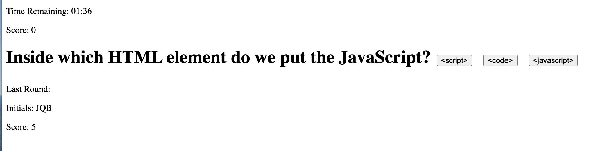

# TimedTest
https://jordanbehn.github.io/TimedTest

This application runs a timed javascript quiz. The user is given a question and clicks the button of their answer. The number of correct answers is displayed as they go as well as the time remaining. Following completion of the quiz or time running out, the user is prompted to enter their initials. The previous attempt's score + initials are saved in local storage and displayed on the page.

